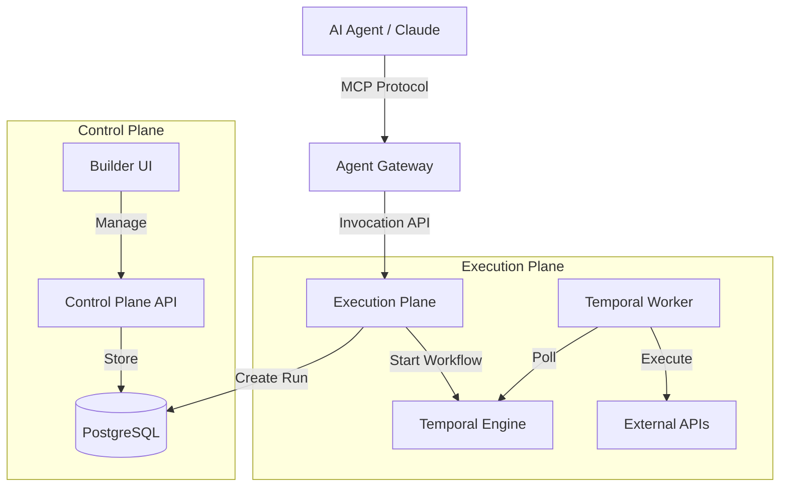

# Google Anti-Gravity: System Walkthrough

This document guides you through setting up, running, and using the **Google Anti-Gravity** Governed Action Layer.

## 1. System Overview

Google Anti-Gravity is a platform that allows Agentic AI to execute business actions safely. It separates **Decision** (Agent) from **Execution** (Workflow), ensuring all actions are:
- **Governed**: Only approved skills can be called.
- **Audited**: Every step and input/output is logged.
- **Human-in-the-Loop**: Critical actions require explicit approval.

### Architecture



## 2. Prerequisites

- **Node.js** (v18+)
- **Docker & Docker Compose** (for Database and Temporal)
- **NPM** (v9+)

## 3. Setup & Installation

### A. Infrastructure
Start the supporting services (PostgreSQL, Temporal Server).
```bash
cd infra
docker-compose up -d
```
*Wait for Temporal to become healthy (usually via http://localhost:8080).*

### B. Build Project
Install dependencies and build the monorepo.
```bash
# Root directory
npm install
npm run build
```

### C. Database Setup
Push the schema to your local PostgreSQL instance.
```bash
cd packages/database
npx prisma db push
```

## 4. Running the Services

You will need multiple terminal tabs to run the microservices.

### Terminal 1: Control Plane (Governance API)
Manages workflows, skills, and permissions.
```bash
cd services/control-plane
npm run dev
# Running on http://localhost:3001
```

### Terminal 2: Execution Plane (Action API)
Handles run requests, approvals, and audit logging.
```bash
cd services/execution-plane
npm run dev
# Running on http://localhost:3002
```

### Terminal 3: Temporal Worker
Executes the actual workflow logic (HTTP calls, AI steps).
```bash
cd services/execution-plane
npx tsx src/worker.ts
# Polling 'anti-gravity-queue'
```

### Terminal 4: Builder UI (Frontend)
The web interface for humans.
```bash
cd web/builder-ui
npm run dev
# Running on http://localhost:3000
```

### Agency Gateway (MCP)
This is typically run by your Agent Client (e.g., Claude Desktop, Cursor).
To test locally:
```bash
cd services/agent-gateway
npm start
# Runs in stdio mode (waiting for JSON-RPC input)
```

## 5. End-to-End Usage Flow

### Step 1: Create a Workflow (Builder UI)
1. Open http://localhost:3000.
2. Click **New Workflow**.
3. Use the Editor to design a flow: `Start` -> `HTTP Action` -> `Approval` -> `End`.
4. Click **Publish Skill**. This makes it available to agents.

### Step 2: Agent Discovery
If you connect an MCP-compatible agent to the Gateway:
1. The agent calls `list_tools`.
2. It sees your new skill as a tool, e.g., `execute_refund_approval`.

### Step 3: Invocation
1. The agent calls the tool with arguments: `call_tool("execute_refund_approval", { amount: 500 })`.
2. **Gateway** calls **Execution Plane**.
3. **Execution Plane** creates a `Run` and starts the **Temporal Workflow**.
4. **Worker** executes the HTTP step.
5. **Worker** hits the `Approval` step and pauses execution (`WAITING_APPROVAL`).

### Step 4: Human Approval
1. Go to the **Runs & Approvals** page in the UI.
2. See the pending run (Status: `WAITING_APPROVAL`).
3. Click "Approve".
4. The **Control Plane** signals Temporal.
5. **Worker** resumes and completes the workflow.

### Step 5: Audit
Check the database `audit_events` table to see the full immutable log of the transaction, including who invoked it and who approved it.

## 6. Troubleshooting

- **Temporal Connection Error**: Ensure Docker containers are running and `TEMPORAL_ADDRESS` env var is correct.
- **Database Error**: Ensure you ran `npx prisma db push`.
- **TS Build Errors**: Run `npm run build` in root to ensure shared types are synchronized.
